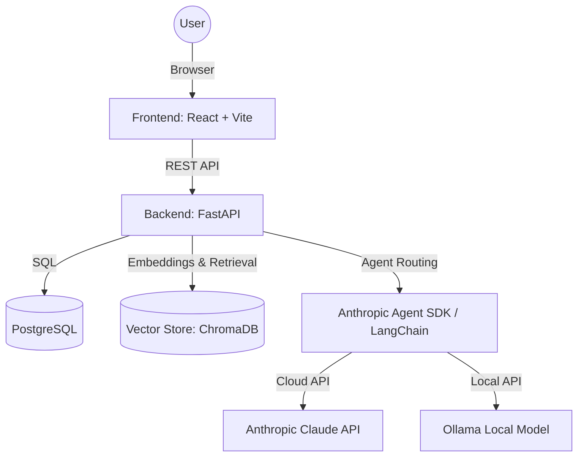
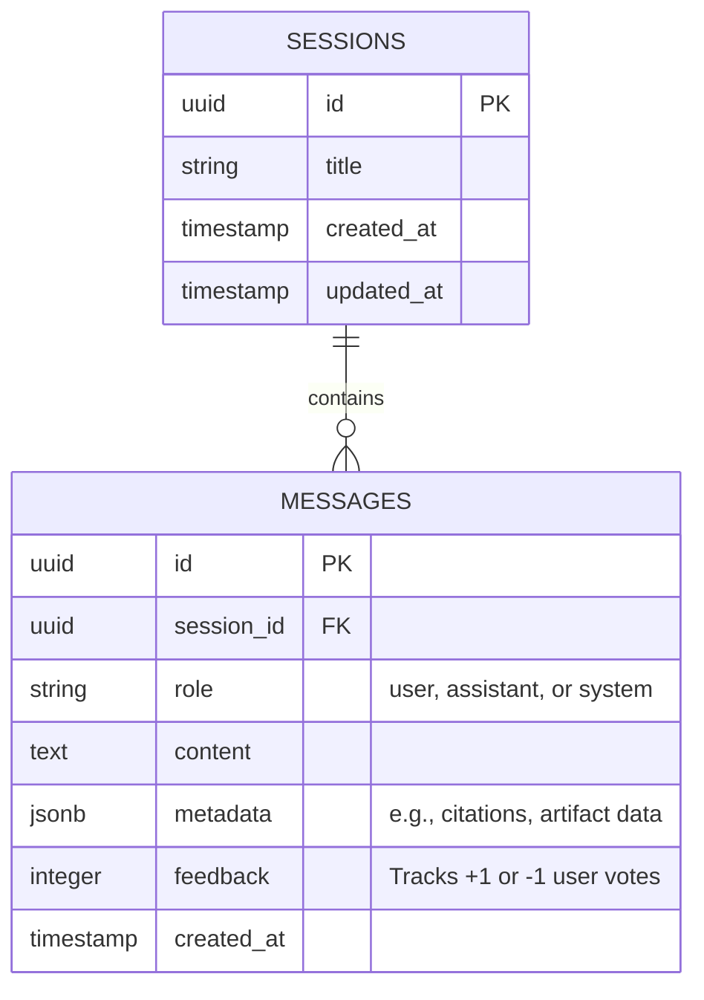

# System Architecture: The Lenny Growth Assistant

## 1. High-Level Topology

The application follows a standard modern web architecture deployed via Docker Compose for easy evaluation.

## 2. Component Boundaries

### 2.1 Frontend (React / Vite)
- **Chat Interface:** A premium, glassmorphic UI that manages user input, displays message history, and handles interactive elements like feedback buttons and dynamic suggestion pills.
- **Artifact Viewer:** A split-pane component that isolates and renders Markdown/HTML blocks identified in the LLM's response.
- **State Management:** React hooks manage streaming chunks, eliminating duplicate loading state bubbles through unified component rendering.

## 3. Backend Architecture

### API & Persistence (FastAPI + PostgreSQL)
- **Framework**: Built natively on FastAPI, providing automatic OpenAPI specs and async capabilities.
- **Database**: PostgreSQL (provisioned via Docker).
- **ORM**: SQLAlchemy handles session persistence. We also leverage `SQLAlchemyCache` for Langchain to cache exact-match LLM queries natively in Postgres.
- **Telemetry**: The `messages` schema includes a `feedback` integer column (-1, 0, 1) tracking user sentiment.

### Agent & Knowledge Base (Langchain + Chroma)
- **Tool Handling & Hallucination Prevention**: Uses conditional tool binding (e.g. `bind_tools` is only attached if specific keywords are detected) to stop smaller local models (like Llama 3.1 8B) from aggressively hallucinating tool calls on standard RAG queries.
- **Reciprocal Rank Fusion (RRF)**: Implements a custom `EnsembleRetriever` combining dense vector search (ChromaDB) with sparse keyword search (BM25) to radically improve retrieval recall.
- **Live Ingestion Daemon**: 
  - Instead of requiring manual batch scripts, a background `watchdog` process starts silently with FastAPI.
  - It monitors the `lennys-podcast-transcripts/` directory for any file creations or modifications.
  - Upon detecting a change, it asynchronously chunks (500 char chunk / 50 overlap) and embeds the file into ChromaDB, making the pipeline perfectly real-time.

## 4. Database Schema (PostgreSQL)

## 5. Security & Artifact Isolation

- **Untrusted HTML:** All HTML generated by the LLM is treated as untrusted.
- **Isolation Strategy:** The Artifact Viewer uses an `<iframe>` with the `sandbox` attribute to prevent XSS.
- **Secrets:** API keys are passed exclusively via environment variables.
