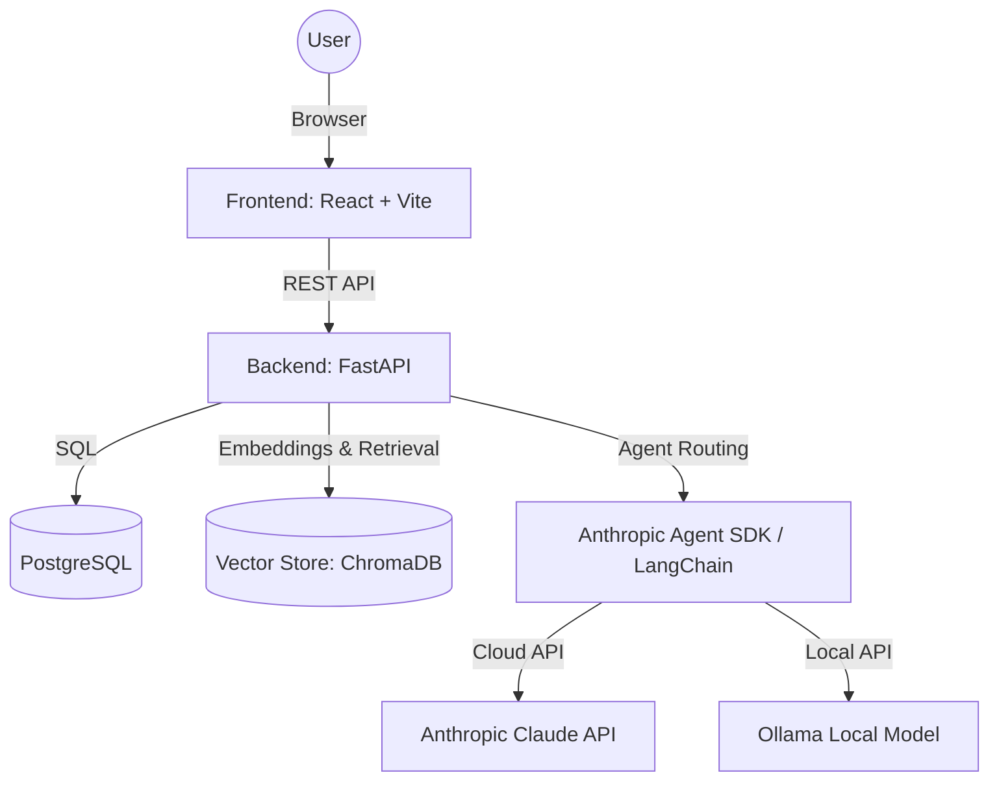
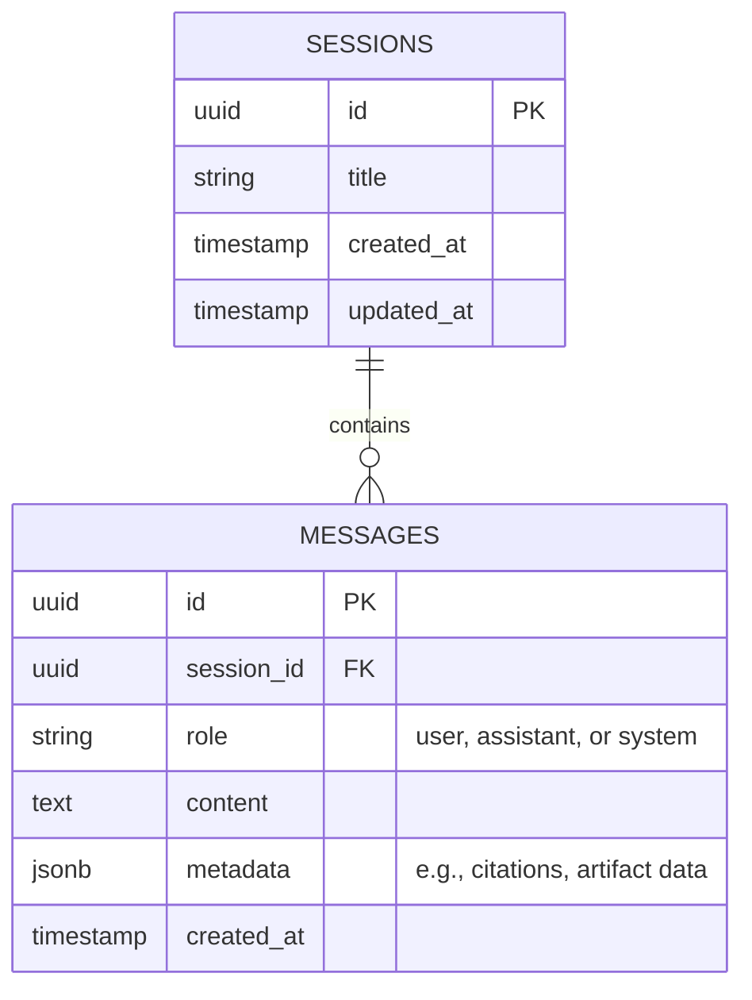

# System Architecture: The Lenny Growth Assistant

## 1. High-Level Topology

The application follows a standard modern web architecture deployed via Docker Compose for easy evaluation.

## 2. Component Boundaries

### 2.1 Frontend (React / Vite)
- **Chat Interface:** Manages user input, displays message history, and handles loading states.
- **Artifact Viewer:** A split-pane component that isolates and renders HTML or Markdown blocks identified in the LLM's response.
- **State Management:** React hooks for managing active sessions and message streaming.

### 2.2 Backend API (FastAPI)
- Provides RESTful endpoints for CRUD operations on sessions and messages.
- Manages the orchestration between the database, the agent SDK, and the LLMs.
- Handles error boundaries (e.g., catching LLM timeouts and returning structured error responses to the frontend).

### 2.3 Agent Layer (LangChain / Anthropic SDK)
- **Router:** Determines whether the user's input requires the RAG tool (Knowledge Base) or the Formatting tool (Ship 30 for 30).
- **LLM Abstraction:** Implements a factory pattern to seamlessly switch between the `ChatAnthropic` and `ChatOllama` clients based on environment configuration.

## 3. Database Schema (PostgreSQL)

## 4. Ingestion and Retrieval Flow

1. **Ingestion Script:** A standalone Python script reads the `.md` or `.txt` transcript files.
2. **Chunking:** Documents are split using a `RecursiveCharacterTextSplitter` (e.g., 1000 characters with 200 character overlap) to maintain contextual boundaries.
3. **Embedding:** Chunks are embedded using an embedding model (e.g., `nomic-embed-text` via Ollama for local, or `text-embedding-3-small` for cloud).
4. **Storage:** Vectors and metadata (source filename, chunk index) are stored in ChromaDB locally.
5. **Retrieval:** When a user asks a question, the query is embedded, and the top-k most similar chunks are retrieved and injected into the LLM prompt.

## 5. Security & Artifact Isolation

- **Untrusted HTML:** All HTML generated by the LLM is treated as untrusted.
- **Isolation Strategy:** The Artifact Viewer uses an `<iframe>` with the `sandbox` attribute.
  - `<iframe sandbox="allow-same-origin">` ensures that scripts cannot execute, preventing Cross-Site Scripting (XSS), while allowing CSS and HTML layout rendering.
- **Secrets:** API keys (`ANTHROPIC_API_KEY`, etc.) are passed exclusively via environment variables and are never committed to the repository.
