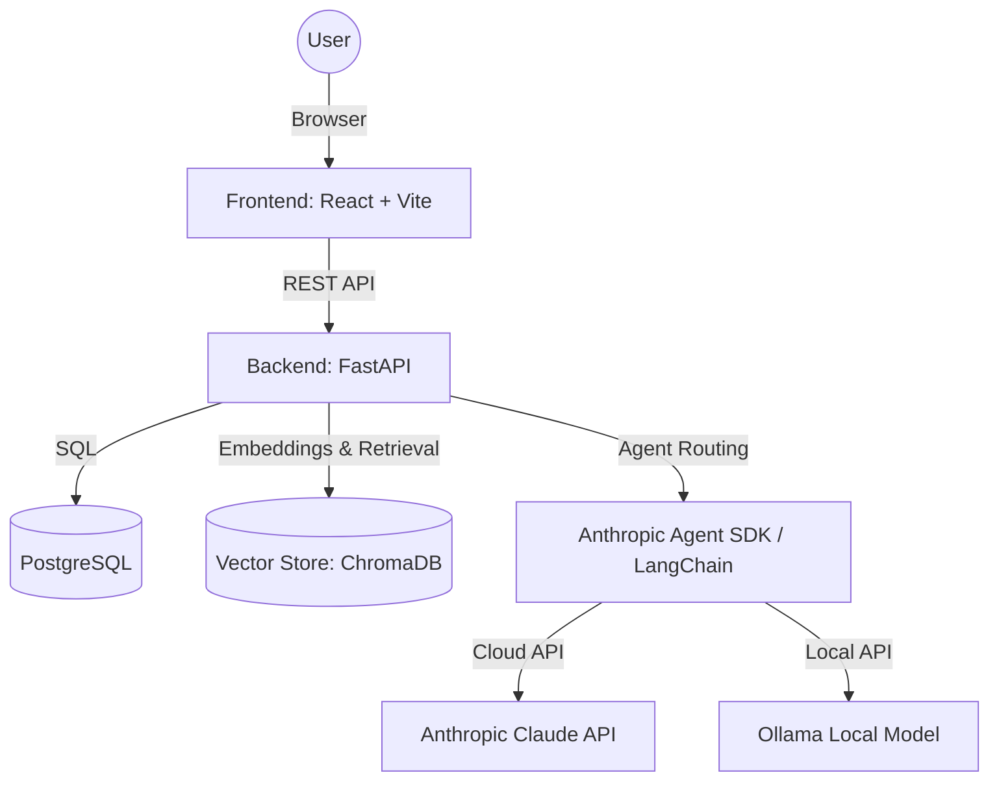
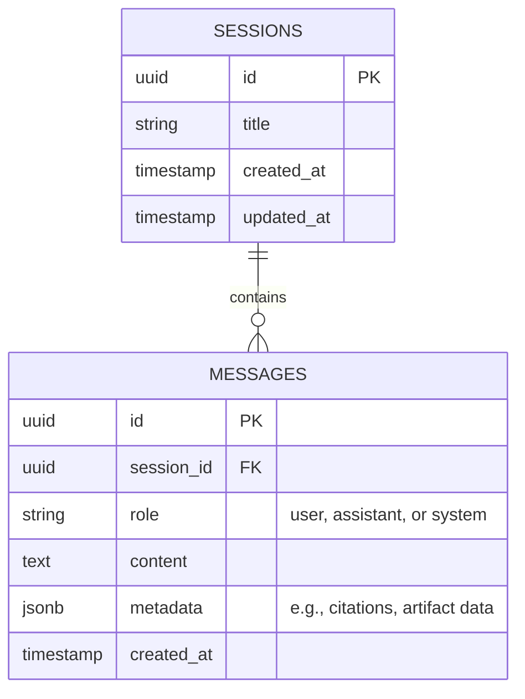

# System Architecture: The Lenny Growth Assistant

## 1. High-Level Topology

The application follows a standard modern web architecture deployed via Docker Compose for easy evaluation.

## 2. Component Boundaries

### 2.1 Frontend (React / Vite)
- **Chat Interface:** Manages user input, displays message history, and handles loading states.
- **Artifact Viewer:** A split-pane component that isolates and renders HTML or Markdown blocks identified in the LLM's response.
- **State Management:** React hooks for managing active sessions and message streaming.

## Backend Architecture

### API & Persistence (FastAPI + PostgreSQL)
- **Framework**: Built natively on FastAPI, providing automatic OpenAPI specs, strong typing (Pydantic), and async-first capabilities.
- **API Quality**: Implemented a dedicated `/health` endpoint to verify DB connections. All routes use structured response schemas, and a global exception handler catches and structures 500-level errors for API resilience.
- **Database**: PostgreSQL (provisioned via Docker). Selected for transactional reliability and future extensibility (e.g. pgvector if we outgrow Chroma).
- **ORM**: SQLAlchemy handles session persistence and message logging, tying each message to a user session.

### Agent & Knowledge Base (Langchain + Chroma)
- **Agent Integration**: Built using the Langchain framework, which abstracts both the Anthropic SDK (Cloud) and Ollama SDK (Local). This allows us to seamlessly toggle between the models while maintaining a uniform execution path. 
- **Ingestion Strategy**:
  - **Loading**: Transcripts are fetched from the `ChatPRD/lennys-podcast-transcripts` repository. We use Langchain's `DirectoryLoader` and `TextLoader` to recursively ingest `.md` files.
  - **Chunking**: `RecursiveCharacterTextSplitter` chunks the documents into 500-character segments with a 50-character overlap to preserve semantic continuity across paragraph boundaries.
  - **Indexing**: Chunks are embedded using `nomic-embed-text` and pushed to a persistent local ChromaDB instance (`./chroma_db`).
  - **Refreshing**: The ingestion script (`ingest.py`) is designed as a standalone operational job. An admin can run it via `docker-compose exec backend python ingest.py` whenever new podcast files are added to the repo.
  - **Tracing & Grounding**: `DirectoryLoader` automatically injects the source filepath into the chunk metadata (`metadata["source"]`). During retrieval, the agent dynamically prepends the `Source: <filepath>` to the context, and the system prompt strictly enforces that the LLM cite this source when generating grounded answers.

## 3. Database Schema (PostgreSQL)

## 4. Ingestion and Retrieval Flow

1. **Ingestion Script:** A standalone Python script reads the `.md` or `.txt` transcript files.
2. **Chunking:** Documents are split using a `RecursiveCharacterTextSplitter` (e.g., 1000 characters with 200 character overlap) to maintain contextual boundaries.
3. **Embedding:** Chunks are embedded using an embedding model (e.g., `nomic-embed-text` via Ollama for local, or `text-embedding-3-small` for cloud).
4. **Storage:** Vectors and metadata (source filename, chunk index) are stored in ChromaDB locally.
5. **Retrieval:** When a user asks a question, the query is embedded, and the top-k most similar chunks are retrieved and injected into the LLM prompt.

## 5. Security & Artifact Isolation

- **Untrusted HTML:** All HTML generated by the LLM is treated as untrusted.
- **Isolation Strategy:** The Artifact Viewer uses an `<iframe>` with the `sandbox` attribute.
  - `<iframe sandbox="allow-same-origin">` ensures that scripts cannot execute, preventing Cross-Site Scripting (XSS), while allowing CSS and HTML layout rendering.
- **Secrets:** API keys (`ANTHROPIC_API_KEY`, etc.) are passed exclusively via environment variables and are never committed to the repository.
