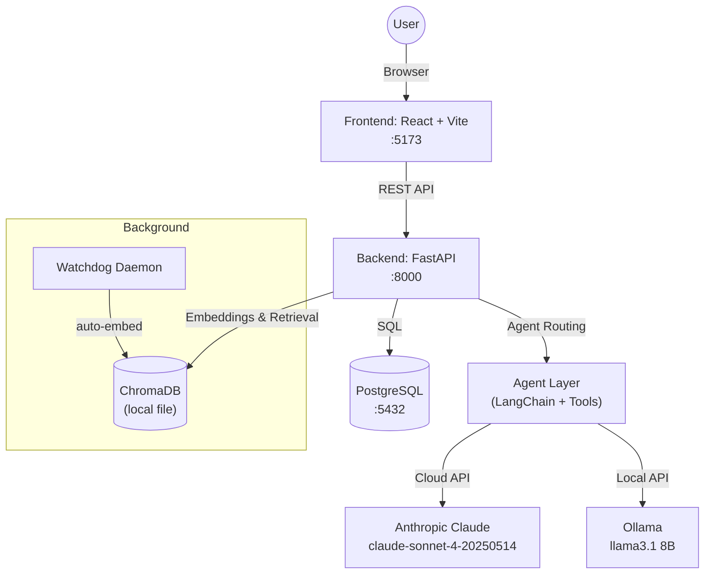
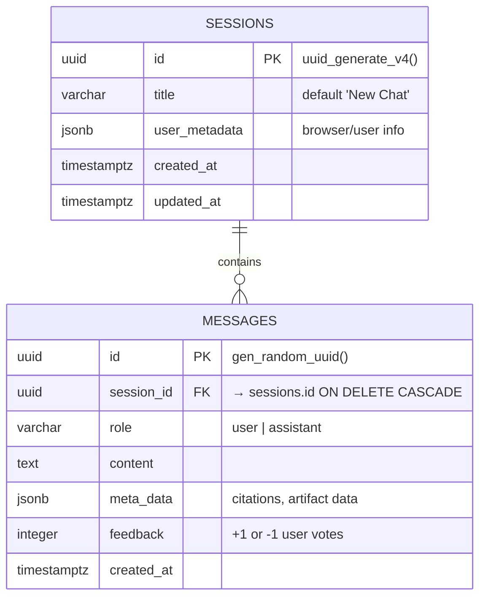
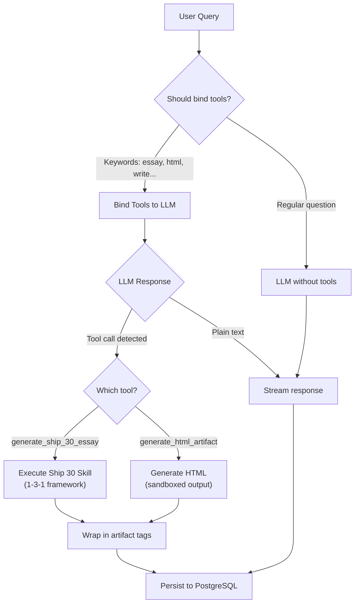
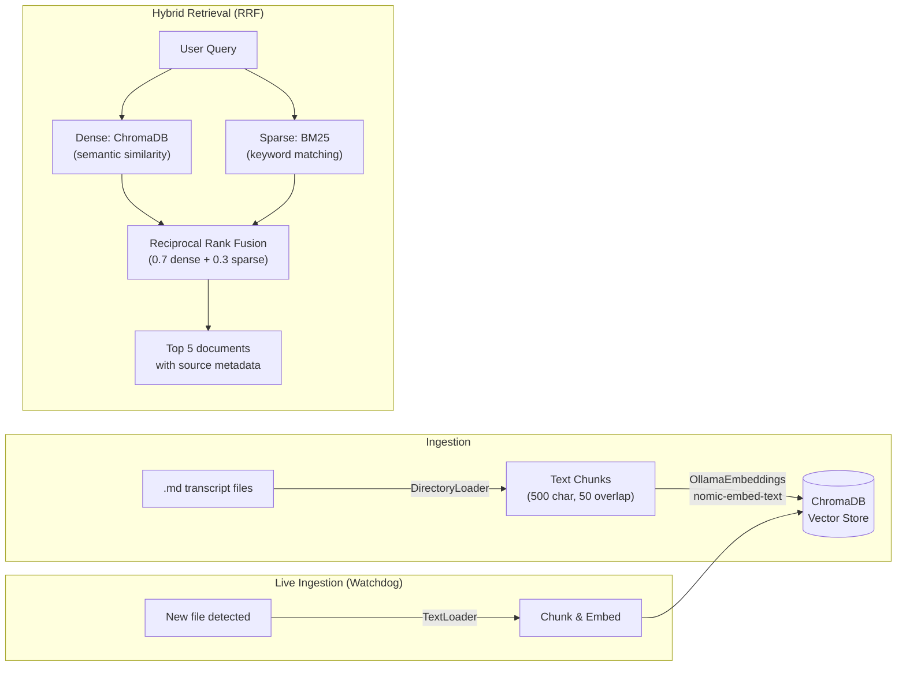
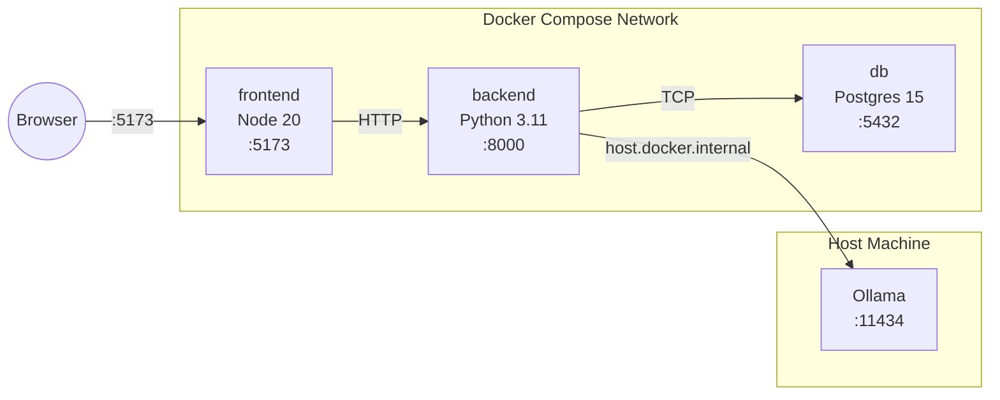

# System Architecture: The Lenny Growth Assistant

## 1. High-Level Topology

The application follows a standard modern web architecture deployed via Docker Compose for easy evaluation.



## 2. Component Boundaries

### 2.1 Frontend (React / Vite / TypeScript)
- **Chat Interface:** A premium, glassmorphic UI that manages user input, displays streaming message history, and handles interactive elements like feedback buttons and dynamic suggestion pills.
- **Artifact Viewer:** A split-pane component that isolates and renders Markdown/HTML blocks detected via `<artifact>` tags. Uses a strictly sandboxed `<iframe>` for HTML content.
- **State Management:** React hooks manage streaming chunks, provider selection, and session switching.
- **Accessibility:** Semantic HTML (`<aside>`, `<main>`, `<header>`, `<nav>`), ARIA labels, keyboard navigation (Enter to send, Shift+Enter for newline).

### 2.2 Backend (FastAPI)
- **API Layer:** RESTful endpoints for sessions, chat, feedback, health, and configuration.
- **Agent Layer:** LangChain-based agent with tool calling, conditional tool binding, and hybrid retrieval.
- **Persistence:** SQLAlchemy ORM with PostgreSQL. LLM responses cached via `SQLAlchemyCache`.
- **Background Services:** Watchdog file observer for live transcript ingestion.

## 3. API Endpoints

| Method | Path | Description | Request Body | Response |
|--------|------|-------------|--------------|----------|
| `GET` | `/health` | System health check | — | `{ status, database, ollama, version }` |
| `GET` | `/config` | Available providers & settings | — | `{ available_providers[], default_provider, ... }` |
| `POST` | `/sessions` | Create a new chat session | `{ title?: string }` | `SessionResponse` |
| `GET` | `/sessions` | List all sessions (newest first) | — | `SessionResponse[]` |
| `GET` | `/sessions/{id}` | Get session with messages | — | `SessionResponse` (includes `messages[]`) |
| `POST` | `/sessions/{id}/chat` | Send message, get streamed response | `{ message: string, llm_provider: string }` | `text/event-stream` |
| `POST` | `/messages/{id}/feedback` | Submit feedback on a message | `{ feedback: 1 \| -1 }` | `{ status, message_id, feedback }` |

### Error Responses
All errors follow a consistent structure:
```json
{
  "error": "Error Type",
  "message": "Human-readable description",
  "path": "/sessions/..."
}
```
- `404` — Resource not found (session, message)
- `422` — Validation error (missing fields, invalid feedback value)
- `500` — Internal server error (with request correlation ID in logs)

## 4. Database Schema (PostgreSQL)



## 5. Agent Routing & Tool Dispatch



**Why conditional tool binding?** Local 8B models (Llama 3.1) aggressively hallucinate tool calls when tools are always available. We only bind tools when keyword analysis suggests the user wants an artifact, dramatically reducing false tool invocations.

## 6. Ingestion & Retrieval Flow



## 7. Model Toggle Mechanism

| Provider | Model | Type | Config Key | Fallback |
|----------|-------|------|------------|----------|
| `ollama` (default) | `llama3.1` 8B | Local | `OLLAMA_BASE_URL` | Error streamed to chat with diagnostic message |
| `anthropic` | `claude-sonnet-4-20250514` | Cloud | `ANTHROPIC_API_KEY` | `ValueError` with instructions to set key |
| `openai` (optional) | `gpt-4o` | Cloud | `OPENAI_API_KEY` | `ValueError` with instructions to set key |

The toggle is visible in the UI header. The `get_llm(provider)` factory in `agent.py` validates that required API keys exist before attempting a connection, returning actionable error messages.

## 8. Security & Artifact Isolation

### Artifact Rendering Strategy
Generated HTML is treated as **untrusted content**:

| Control | Implementation | What it blocks |
|---------|---------------|----------------|
| `sandbox=""` (empty) | Strictest iframe sandbox | Scripts, forms, popups, same-origin access, top navigation |
| No `allow-scripts` | Scripts cannot execute | XSS, crypto mining, data exfiltration |
| No `allow-same-origin` | Iframe has opaque origin | Cannot read parent cookies, localStorage, or session data |
| Blob URL | Content served via `URL.createObjectURL` | No network requests from iframe |

**Markdown** is rendered via `react-markdown`, which parses Markdown to React elements (no `dangerouslySetInnerHTML`).

### API Security
- API keys are passed exclusively via environment variables (never hardcoded)
- `.env` files are `.gitignore`d and never committed
- CORS is configured (currently open for dev; should be restricted in production)

## 9. Deployment Topology



**Key networking detail:** Ollama runs on the host machine (not in Docker) because it needs direct GPU access. The backend reaches it via `host.docker.internal:11434`.

## 10. Observability

- **Structured Logging:** All logs use format `TIMESTAMP [LEVEL] logger_name | message`
- **Request Correlation:** Each HTTP request gets a unique `X-Request-ID` header, logged on entry and exit with response time
- **Performance Tracking:** Retrieval time and LLM stream duration are logged with millisecond precision
- **Health Checks:** `/health` endpoint reports database and Ollama connectivity status
- **Error Tracking:** All exceptions include `exc_info=True` for full stack traces in logs
